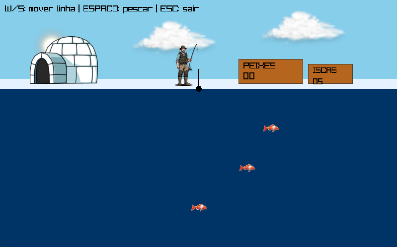

# <p align="center">Pescaria no Gelo - Trabalho de SO</p>
### <p align="center">*SSC0140 – Sistemas Operacionais I*</p>

<p align="center">
    <a href="#1-introdução">Introdução</a> •
    <a href="#2-descrição-geral-do-jogo">Descrição Geral</a> •
    <a href="#3-estrutura-de-arquivos">Estrutura de Arquivos</a> •
    <a href="#4-estruturas-de-dados">Estruturas de Dados</a> •
    <a href="#5-aplicação-de-conceitos-de-sistemas-operacionais">Conceitos de SO</a> •
    <a href="#6-instalação-execução-e-guia-de-jogabilidade">Instalação & Execução</a> •
    <a href="#7-conclusão">Conclusão</a> •
    <a href="#8-participantes">Participantes</a> •
    <a href="#9-apresentação-em-vídeo">Apresentação em Vídeo</a>
</p>

<div align="center">
    
</div>

---

## 1. Introdução
Este projeto consiste no desenvolvimento de um jogo simples de pesca, criado como trabalho final da disciplina Sistemas Operacionais I. O objetivo principal é demonstrar o conhecimento dos conceitos de threads e semáforos através de uma aplicação prática em um jogo.  

O jogo foi inspirado no minigame ["Pescaria no Gelo"](https://clubpenguinbrasil.fandom.com/pt-br/wiki/Pescaria_no_Gelo), incluso no jogo [Club Penguin](https://clubpenguinbrasil.fandom.com/pt-br/wiki/Club_Penguin_Brasil_Wiki).  O jogo simula uma pescaria em que o jogador controla a profundidade de uma linha de pesca e tenta pescar peixes que se movimentam horizontalmente no mar, onde o objetivo é pescar o maior número possível de peixes antes que as iscas acabem. Embora visualmente simples, o funcionamento interno do jogo utiliza múltiplas threads para representar o movimento de cada peixe, além de um semáforo que garante que apenas um peixe possa ser capturado por vez.  

A escolha da biblioteca Raylib permitiu uma interface gráfica leve e adequada para aplicações simples em C++, tornando o projeto mais bonito. Assim, este trabalho une fundamentos de Sistemas Operacionais com uma aplicação lúdica, reforçando os conceitos estudados em aula.

---

## 2. Descrição Geral do Jogo

### 2.1 Jogabilidade do Jogador
O jogador controla apenas duas coisas: a altura do anzol e ação de pesca.  

A profundidade da linha varia entre quatro níveis (-1, 0, 1 e 2), controlados pelas teclas W (subir) e S (descer). A profundidade -1 é acima do gelo e as outras três são no mar em si.

A ação de pescar é feita pela tecla ESPAÇO, o que inicia uma tentativa de pesca na profundidade em que o anzol está, consumindo uma isca. Se o peixe estiver em cima do anzol no momento em que apertou ESPAÇO, ele é capturado.

### 2.2 Movimento dos Peixes
Os peixes são elementos autônomos dentro do jogo: cada peixe possui uma **thread** própria responsável por mover sua posição horizontal.

Eles se deslocam continuamente da esquerda para a direita e reiniciam o trajeto ao sair da tela.

As velocidades variam entre os peixes e aumentam ao longo da partida, introduzindo progressão de dificuldade.

### 2.3 Mecânica de Captura
A captura de peixes envolve lógica de colisão e sincronização:

Quando o jogador pressiona ESPAÇO, é feita uma verificação para confirmar se existe um peixe na mesma profundidade e próximo da linha (em pixels).

Se houver, o peixe é marcado como capturado, “gruda” na ponta da linha e sobe com ela.

Enquanto um peixe está sendo puxado, nenhuma outra captura é permitida. Essa exclusão mútua é implementada com um semáforo binário, que garante que apenas um peixe pode estar em estado de captura.

Ao chegar novamente à superfície, a captura é concluída, o semáforo é liberado e o peixe é reposicionado no início da tela com velocidade aumentada. É necessário levar o peixe para a superfície para que contabilize como pescado.

Essa mecânica reforça o conceito de sincronização entre a thread principal e as threads de movimento.

### 2.4 Iscas e Condição de Derrota
O jogador começa com um número limitado de iscas (5).

Cada tentativa de pesca consome uma isca, independentemente de sucesso.

Quando as iscas chegam a zero e não há nenhum peixe sendo puxado, o jogo termina.

Uma tela de Game Over é exibida mostrando o número total de peixes capturados e informando o jogador que pode reiniciar com a tecla R.

### 2.5 Controles do Jogo
W – Subir a linha  
S – Descer a linha  
ESPAÇO – Tentar pescar  
R – Reiniciar o jogo  
ESC – Sair

---

## 3. Estrutura de Arquivos
- `/assets` — contém os arquivos `.png` utilizados como sprites
- `/cmake-build-debug` — pasta com a configuração de execução de C++
- `/include` — todos os arquivos `.h` do projeto, incluindo definição de structs, declarações de threads, etc
- `raylib-master` — diretório com a biblioteca gráfica Raylib, utilizada para a construção da interface visual do jogo
- `/src` — arquivos `.cpp` responsáveis pela implementação do jogo em si
- `CMakeLists.txt` — diretório gerado automaticamente pelo CMake contendo binários, objetos compilados e configurações de execução
- `README.md` — documentação com manual de uso, descrição técnica, etc

---

## 4. Estruturas de Dados

### 4.1 `struct Peixe`
Representa:
- profundidade
- posição horizontal
- velocidade
- estado de captura

### 4.2 `struct EstadoJogo`
Contém:
- vetor de peixes
- threads
- mutex
- semáforo
- estado da linha
- contadores
- texturas
- flag `rodando`

---

## 5. Aplicação de Conceitos de Sistemas Operacionais
Esta seção descreve como os principais conceitos de **Sistemas Operacionais** (*threads*, *concorrência*, *mutex* e *semáforos*) foram aplicados no desenvolvimento do jogo.

### 5.1 Uso de Threads
O jogo utiliza **múltiplas threads reais** (`std::thread`), onde cada peixe é controlado por uma thread independente.  
Isso simula agentes autônomos executando em paralelo, garantindo movimento contínuo e assíncrono.

#### Justificativa
O uso de threads permite que cada peixe:

- se mova de forma contínua sem bloquear a thread principal;
- mantenha comportamento independente dos demais;
- não interfira com a captura ou com a renderização.

#### Código (Thread de Movimento de um Peixe)
```cpp
void ThreadMovPeixe(EstadoJogo *jogo, int index) {
    while (jogo->rodando) {
        {
            std::lock_guard<std::mutex> lock(jogo->mutexPeixes);

            Peixe &p = jogo->peixes[index];

            if (!p.capturado) {
                p.x += p.velocidade * 0.016f;

                if (p.x > 850)
                    p.x = -jogo->texPeixe.width;
            }
        }

        std::this_thread::sleep_for(std::chrono::milliseconds(16));
    }
}
```

Cada thread executa seu próprio loop, atualizando a posição horizontal do peixe 60 vezes por segundo.

### 5.2 Uso de Mutex
Com múltiplas threads acessando os mesmos dados (posição dos peixes, flags, velocidade), surgem problemas clássicos de concorrência:

- **race conditions**
- **leituras inconsistentes** no momento de renderizar
- **peixes capturados sendo alterados enquanto são desenhados**

Para evitar esses problemas, foi utilizado **mutex** para proteger regiões críticas.

O `std::mutex` garante **exclusão mútua** ao acessar ou alterar dados compartilhados entre threads.

#### Regiões protegidas pelo mutex
- posição horizontal do peixe (`x`);
- estado de captura (`capturado`);
- velocidade;
- leitura durante o render;
- manipulação do peixe capturado.

#### Código — Região Crítica Protegida
```cpp
{
    std::lock_guard<std::mutex> lock(jogo->mutexPeixes);

    Peixe &p = jogo->peixes[index];

    if (!p.capturado) {
        p.x += p.velocidade * 0.016f;

        if (p.x > 850)
            p.x = -jogo->texPeixe.width;
    }
}
```

O `lock_guard` garante que **somente uma thread por vez** acessa os dados do peixe.

### 5.3 Uso de Semáforo
O jogo utiliza um **semáforo binário** (`std::binary_semaphore`) para controlar o acesso exclusivo à linha de pesca.

#### Justificativa do Semáforo
O semáforo garante que:

- **apenas um peixe pode ser capturado por vez**
- impede que o jogador pressione espaço repetidamente e capture vários peixes simultaneamente
- impede que duas threads tentem manipular estados de captura ao mesmo tempo

#### Código — Tentativa de Captura
```cpp
if (IsKeyPressed(KEY_SPACE) && !jogo.carregandoPeixe) {

    if (!jogo.semaforoLinha.try_acquire()) {
        return;
    }

    std::lock_guard<std::mutex> lock(jogo.mutexPeixes);

    for (int i = 0; i < 3; i++) {
        Peixe &p = jogo.peixes[i];

        if (p.profundidade == jogo.profundidadeLinha &&
            std::abs(p.x - jogo.xLinha) < 30) {

            p.capturado = true;
            jogo.carregandoPeixe = true;
            jogo.peixeCapturadoIndex = i;
            break;
        }
    }

    if (!jogo.carregandoPeixe)
        jogo.semaforoLinha.release();
}
```

#### Liberação do Semáforo ao Final da Captura
```cpp
if (jogo.profundidadeLinha == -1) {
    // ...
    jogo.semaforoLinha.release();
}
```

### 5.5 Interação entre Threads, Mutex e Semáforo
A sincronização funciona assim:

1. **Thread do peixe** movimenta os peixes continuamente (com mutex).
2. **Thread principal** calcula captura, game over e renderiza.
3. **Semáforo** impede múltiplas capturas simultâneas.
4. **Mutex** garante consistência nos dados enquanto o peixe é manipulado.
5. Threads são encerradas com segurança usando a flag `rodando`.

Essa estrutura demonstra, na prática, diversos conceitos de Sistemas Operacionais:

- exclusão mútua
- controle de acesso concorrente
- coordenação entre múltiplas threads
- recursos compartilhados
- sincronização com semáforo
- paralelismo cooperativo

---

## 6. Instalação, Execução e Guia de Jogabilidade
Esta seção funciona como um **tutorial completo** para instalar, compilar e rodar o jogo, além de explicar todos os controles e regras necessárias para jogar.  

### 6.1 Obtendo o Projeto pelo GitHub
Clone o repositório:

```bash
git clone https://github.com/SEU_USUARIO/jogo-pesca-so.git
cd jogo-pesca-so
```

### 6.2 Dependências Necessárias
Para compilar e executar o projeto, são necessárias as seguintes dependências:

- **C++20**
- **CMake** (facilitador de build)

## 6.3 Compilação (via CMake)
Siga os passos:

```bash
mkdir build
cd build
cmake ..
make
```

Após a conclusão, o executável será gerado como:

```
./trabSO
```

## 6.4 Executando o Jogo
Após a compilação:

```bash
./trabSO
```

---

## 7. Conclusão
Através do desenvolvimento deste projeto, conseguimos colocar em prática diversos conceitos fundamentais estudados na disciplina. A criação de um jogo multithread, ainda que simples, exigiu bom entendimento sobre sincronização, exclusão mútua e coordenação.

Durante a implementação, foi possível observar na prática como condições de corrida e problemas de escalonamento podem surgir mesmo em aplicações pequenas e como o uso de mutexes e semáforos são ótimas ferramentas para contornar esses problemas.

A implementação das threads também mostrou desafios, como o cuidado ao manipular recursos compartilhados, ajustar a taxa de atualização do movimento e garantir o encerramento adequado.

Em resumo, o trabalho ajudou a agregar conhecimento e colocar o que foi visto em sala de aula na prática, ao unir conceitos teóricos de SO com uma aplicação real, mostrando os desafios e soluções com aplicações de conceitos de SO.

---

## 8. Participantes
- Diego Fernandes Lemos - 14758832
- Jaqueline Paes de Almeida - 8927485
- Rafael Meris Manson - 13692438

---

## 9. Apresentação em Vídeo
É possível acessar o vídeo através desse link: <link do video>